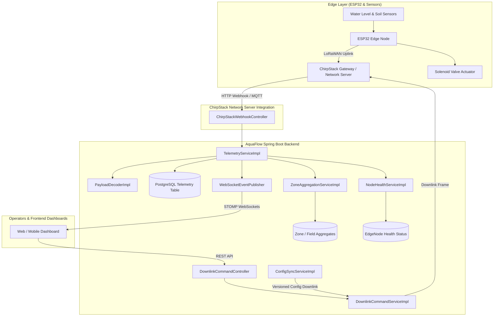
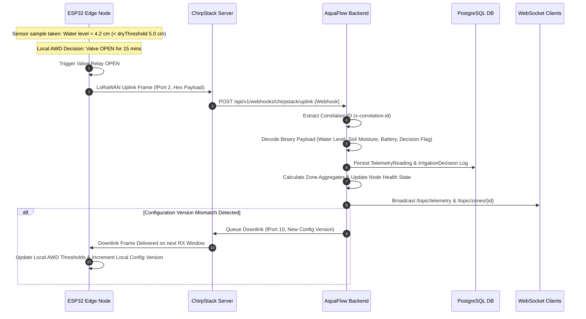
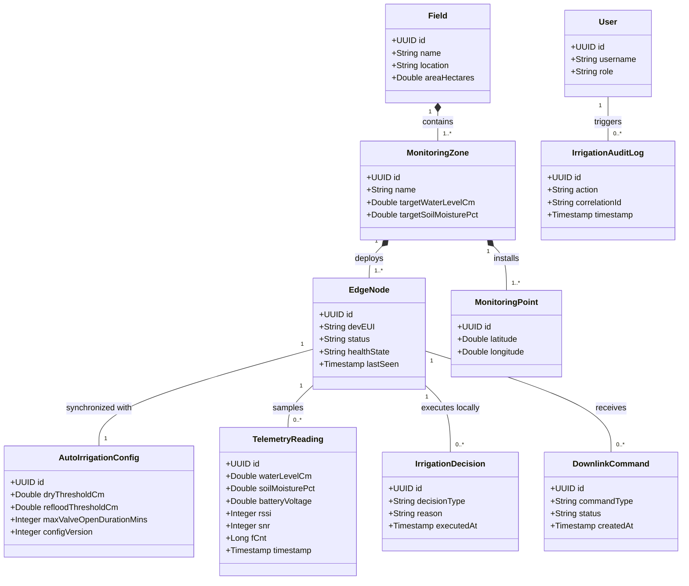
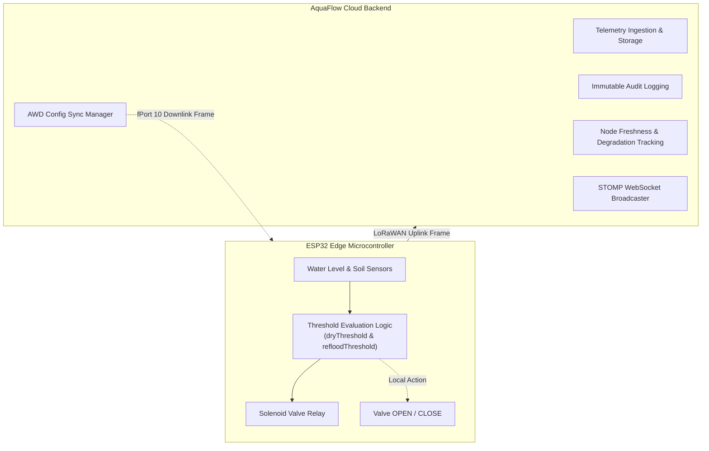

# AquaFlow Backend Services Architecture & Operations Guide

[](https://openjdk.org) [](https://spring.io/projects/spring-boot) [](https://www.postgresql.org) [](https://flywaydb.org) [](https://www.docker.com) [](https://github.com/openspec/openspec)

Production-ready Spring Boot backend for the AquaFlow Smart Alternate Wetting and Drying (AWD) Irrigation System.

> [!IMPORTANT]
> **CRITICAL DOMAIN INVARIANT: ZERO CLOUD AUTONOMOUS DECISIONS**
> 1. **Local Edge Execution**: Irrigation decisions are made locally and autonomously by ESP32 edge nodes based on configured AWD thresholds (`dryThresholdCm`, `refloodThresholdCm`).
> 2. **Cloud Non-Interference**: The Cloud Backend NEVER independently makes autonomous valve open/close decisions.
> 3. **Cloud Responsibilities**: The cloud backend observes telemetry, records decisions, synchronizes configurations (`ConfigSyncTask`), and dispatches operator-initiated manual override or high-priority emergency stop commands.

---

## Table of Contents

- [1. Project Overview & Purpose](#1-project-overview--purpose)
- [2. Architecture & Data Flow](#2-architecture--data-flow)
- [3. Technology Stack](#3-technology-stack)
- [4. Repository Structure](#4-repository-structure)
- [5. Domain Model & Entities](#5-domain-model--entities)
- [6. Complete REST & WebSocket API Inventory](#6-complete-rest--websocket-api-inventory)
- [7. Edge Node Communication & LoRaWAN Transport](#7-edge-node-communication--lorawan-transport)
- [8. Autonomous Edge Irrigation Architecture](#8-autonomous-edge-irrigation-architecture)
- [9. Security & Secret Management](#9-security--secret-management)
- [10. Database Architecture & Migrations](#10-database-architecture--migrations)
- [11. Configuration & Environment Variables](#11-configuration--environment-variables)
- [12. Local Development Setup](#12-local-development-setup)
- [13. API Usage Examples](#13-api-usage-examples)
- [14. Testing Strategy](#14-testing-strategy)
- [15. Observability & Monitoring](#15-observability--monitoring)
- [16. Deployment Architecture](#16-deployment-architecture)
- [17. Development Conventions](#17-development-conventions)
- [18. Current Implementation Status](#18-current-implementation-status)
- [19. Known Limitations & TODOs](#19-known-limitations--todos)
- [20. Quick Reference](#20-quick-reference)

---

## 1. Project Overview & Purpose

**AquaFlow** is an IoT-enabled smart agricultural irrigation platform designed specifically for rice cultivation using Alternate Wetting and Drying (AWD) water management. The system monitors field water levels, soil moisture, battery status, and sensor telemetry across edge-deployed microcontroller nodes (ESP32) and coordinates telemetry ingestion, zone aggregation, cloud-to-edge configuration synchronization, manual irrigation controls, and audit logging.

### Primary Goals
- **Water Conservation**: Automate AWD threshold monitoring to reduce agricultural water consumption by up to 30% while maintaining crop yields.
- **Edge Resilience**: Guarantee continuous field operation even during total cloud disconnects by empowering ESP32 edge nodes with full autonomous decision-making capability.
- **Operational Visibility**: Provide real-time telemetry streaming, aggregated field water-level monitoring, node health degradation tracking, and non-repudiable audit logging.

---

## 2. Architecture & Data Flow

### Cloud vs. Edge Responsibilities Matrix

| Subsystem / Feature | Edge Node (ESP32) Responsibility | Cloud Backend Responsibility | Edge Decision | Cloud Decision |
| :--- | :--- | :--- | :---: | :---: |
| **AWD Threshold Evaluation** | Reads water sensor, evaluates thresholds, triggers local valve relay | Stores threshold versions (`AutoIrrigationConfig`), pushes config downlinks | ✅ | ❌ |
| **Valve Execution** | Drives physical solenoid/actuator valves locally | Dispatches manual override downlinks; issues Emergency Stop commands | ✅ | ❌ |
| **Telemetry & Sensor Data** | Samples water level, soil moisture, battery, RSSI/SNR; encodes LoRaWAN frames | Decodes payloads, validates frame counters (`fCnt`), persists readings, aggregates zone metrics | ❌ | ✅ |
| **Node Health & Freshness** | Transmits periodic heartbeat uplinks and battery state | Monitors node freshness, flags stale telemetry, updates node health states (`HEALTHY`, `DEGRADED`, `CRITICAL`) | ❌ | ✅ |
| **Realtime Monitoring** | Broadcasts telemetry frames over LoRaWAN RF | Streams live telemetry and node status updates over STOMP WebSocket topics to dashboards | ❌ | ✅ |
| **Audit Logging** | Transmits execution ACK frames to cloud | Records immutable `IrrigationAuditLog` and `SystemAuditLog` entries with correlation IDs | ❌ | ✅ |

### High-Level System Architecture Diagram



### Telemetry Ingestion & Autonomous Reporting Sequence



---

## 3. Technology Stack

- **Java JDK**: 21 (LTS)
- **Framework**: Spring Boot 3.2.x
- **Database**: PostgreSQL 16+
- **Database Migration**: Flyway
- **ORM / Data Access**: Spring Data JPA / Hibernate 6
- **Security & Auth**: Spring Security + JWT (`io.jsonwebtoken` 0.12.x)
- **Realtime Streaming**: Spring WebSocket with STOMP & SockJS fallback
- **Observability**: Spring Boot Actuator, Micrometer, Prometheus metrics
- **API Documentation**: Springdoc OpenAPI / Swagger UI 2.x
- **Build Tool**: Apache Maven 3.9+
- **Containerization**: Docker, Docker Compose

---

## 4. Repository Structure

```text
aquaflow_backend/
├── docker-compose.yml              # Multi-container orchestration (DB, App, ChirpStack, Prometheus)
├── Dockerfile                      # Multi-stage production container build
├── pom.xml                         # Maven dependencies & build lifecycle configuration
├── .env.example                    # Template environment variables (no real secrets)
├── README.md                       # Repository technical documentation
└── src/
    ├── main/
    │   ├── java/com/aquaflow/backend/
    │   │   ├── config/             # Spring Security, WebSocket, Async, OpenAPI configs
    │   │   ├── controller/         # REST & Webhook HTTP controllers
    │   │   ├── dto/                # Data Transfer Objects & Request/Response schemas
    │   │   ├── entity/             # JPA Entities (EdgeNode, TelemetryReading, Field, etc.)
    │   │   ├── exception/          # Global Exception Handling & Custom Exceptions
    │   │   ├── infrastructure/     # External integrations (ChirpStack, MQTT)
    │   │   ├── repository/         # Spring Data JPA Repositories
    │   │   ├── security/           # JWT Filters, Role definitions, Auth Providers
    │   │   ├── service/            # Core Business Logic & Domain Services
    │   │   │   └── impl/           # Business logic service implementations
    │   │   └── websocket/          # STOMP WebSocket handlers & topic publishers
    │   └── resources/
    │       ├── application.properties         # Main application configuration
    │       ├── application-dev.properties     # Development profile configuration
    │       ├── application-prod.properties    # Production profile configuration
    │       └── db/migration/                  # Flyway SQL migration scripts
    │           ├── V1__init_schema.sql
    │           ├── V2__seed_initial_data.sql
    │           └── V3__add_telemetry_indexes.sql
    └── test/
        └── java/com/aquaflow/backend/ # Unit & Integration Test Suites
```

---

## 5. Domain Model & Entities

### Domain Class Diagram



### Entity Descriptions
- **`Field`**: Agricultural field boundary containing multiple monitoring zones.
- **`MonitoringZone`**: Specific sub-area within a field with designated target water level thresholds.
- **`EdgeNode`**: ESP32 microcontroller device deployed in a monitoring zone, identified by a unique `devEUI`.
- **`MonitoringPoint`**: Physical sensor installation point within a zone.
- **`TelemetryReading`**: Time-series telemetry sample (water level cm, soil moisture %, battery voltage, RSSI, SNR, fCnt).
- **`IrrigationDecision`**: Autonomous valve action executed locally by ESP32 (`VALVE_OPEN`, `VALVE_CLOSE`, `IDLE`).
- **`AutoIrrigationConfig`**: AWD threshold parameters (`dryThresholdCm`, `refloodThresholdCm`, `maxValveOpenDurationMins`, `configVersion`).
- **`DownlinkCommand`**: Queue item for manual override or configuration sync downlinks to edge nodes.
- **`IrrigationAuditLog`**: Immutable operational and security audit log.
- **`User`**: User entity with assigned authority roles (`ROLE_ADMIN`, `ROLE_OPERATOR`, `ROLE_VIEWER`).

---

## 6. Complete REST & WebSocket API Inventory

All REST endpoints are prefixed with `/api/v1/`.

### Authentication Endpoints (`/api/v1/auth`)

| HTTP Method | Endpoint Path | Description | Access Role |
| :--- | :--- | :--- | :---: |
| `POST` | `/api/v1/auth/login` | Authenticate user credentials and return JWT access token | Public |
| `POST` | `/api/v1/auth/refresh` | Refresh an active or expiring JWT access token | Public |

### Edge Node Management (`/api/v1/nodes`)

| HTTP Method | Endpoint Path | Description | Access Role |
| :--- | :--- | :--- | :---: |
| `GET` | `/api/v1/nodes` | List registered ESP32 edge nodes with optional status filter | `ROLE_VIEWER`+ |
| `GET` | `/api/v1/nodes/{id}` | Fetch single edge node metadata and configuration | `ROLE_VIEWER`+ |
| `POST` | `/api/v1/nodes` | Register a new ESP32 edge node device | `ROLE_OPERATOR`+ |
| `PUT` | `/api/v1/nodes/{id}` | Update node configuration or zone association | `ROLE_OPERATOR`+ |
| `GET` | `/api/v1/nodes/{id}/health` | Retrieve current health state (`HEALTHY`, `DEGRADED`, `CRITICAL`) | `ROLE_VIEWER`+ |

### Telemetry & Zone Aggregates (`/api/v1/telemetry`)

| HTTP Method | Endpoint Path | Description | Access Role |
| :--- | :--- | :--- | :---: |
| `GET` | `/api/v1/telemetry/nodes/{nodeId}` | Retrieve time-series telemetry readings for a node | `ROLE_VIEWER`+ |
| `GET` | `/api/v1/telemetry/zones/{zoneId}` | Retrieve aggregated zone water level and soil moisture metrics | `ROLE_VIEWER`+ |
| `GET` | `/api/v1/telemetry/latest` | Fetch latest telemetry snapshot across all active nodes | `ROLE_VIEWER`+ |

### Downlink & Emergency Controls (`/api/v1/commands`)

| HTTP Method | Endpoint Path | Description | Access Role |
| :--- | :--- | :--- | :---: |
| `POST` | `/api/v1/commands/manual-override` | Dispatch manual valve `OPEN`/`CLOSE` downlink command | `ROLE_OPERATOR`+ |
| `POST` | `/api/v1/commands/emergency-stop` | Issue high-priority Emergency Stop command across zone nodes | `ROLE_ADMIN` |
| `GET` | `/api/v1/commands/status/{commandId}` | Poll execution status of a queued downlink command | `ROLE_VIEWER`+ |

### ChirpStack Integration Webhooks (`/api/v1/webhooks/chirpstack`)

| HTTP Method | Endpoint Path | Description | Access Role |
| :--- | :--- | :--- | :---: |
| `POST` | `/api/v1/webhooks/chirpstack/uplink` | Ingest binary uplink telemetry webhooks from ChirpStack | Webhook Secret |
| `POST` | `/api/v1/webhooks/chirpstack/ack` | Ingest downlink delivery acknowledgement notifications | Webhook Secret |

### Audit Logs (`/api/v1/audit`)

| HTTP Method | Endpoint Path | Description | Access Role |
| :--- | :--- | :--- | :---: |
| `GET` | `/api/v1/audit/logs` | Query immutable operational and security audit trail entries | `ROLE_VIEWER`+ |

### WebSocket Topics (`/ws-aquaflow`)

| Protocol / Transport | Topic Path | Description | Payload Schema |
| :--- | :--- | :--- | :--- |
| STOMP over WS / SockJS | `/topic/telemetry` | Live broadcast of decoded telemetry frames from all edge nodes | `TelemetryDTO` |
| STOMP over WS / SockJS | `/topic/nodes/{id}/status` | Live node health state transitions and battery warnings | `NodeStatusDTO` |
| STOMP over WS / SockJS | `/topic/zones/{id}/aggregates` | Aggregated water level and moisture metrics per zone | `ZoneAggregateDTO` |
| STOMP over WS / SockJS | `/topic/commands/ack` | Real-time downlink execution ACKs from ChirpStack | `CommandAckDTO` |

---

## 7. Edge Node Communication & LoRaWAN Transport

### LoRaWAN Uplink & Frame Handling
- **fPort 2**: Standard telemetry uplink (water level, soil moisture, battery voltage, RSSI, SNR, fCnt, local decision flag).
- **fPort 10**: Configuration sync request / threshold version ACK uplink.
- **fPort 15**: Alarm / Emergency state notification uplink.

### Device Identity Resolution & Webhooks
1. ChirpStack Network Server posts JSON payload to `/api/v1/webhooks/chirpstack/uplink`.
2. Backend validates `X-ChirpStack-Signature` header against `AQUAFLOW_CHIRPSTACK_WEBHOOK_SECRET`.
3. Backend matches `devEUI` to registered `EdgeNode` record in PostgreSQL.
4. Frame counter `fCnt` is validated for replay attack prevention.

---

## 8. Autonomous Edge Irrigation Architecture



---

## 9. Security & Secret Management

### Authentication & Authorization Matrix

| User Role | Telemetry Viewing | Node Registration | Config Update | Manual Override | Emergency Stop |
| :--- | :---: | :---: | :---: | :---: | :---: |
| **`ROLE_VIEWER`** | ✅ | ❌ | ❌ | ❌ | ❌ |
| **`ROLE_OPERATOR`** | ✅ | ✅ | ✅ | ✅ | ❌ |
| **`ROLE_ADMIN`** | ✅ | ✅ | ✅ | ✅ | ✅ |

> [!NOTE]
> **Secret Management**:
> - **JWT Authentication**: Stateless HTTP Bearer authentication via `Authorization: Bearer <token>`.
> - **Docker Secrets**: Production setup mounts secrets to `/run/secrets/` (`db_password`, `jwt_secret`, `webhook_secret`).
> - **Zero Hardcoded Secrets**: Secrets are injected via environment variables or secret files. Never commit real credentials.

---

## 10. Database Architecture & Migrations

- **Database Engine**: PostgreSQL 16+
- **Migration Framework**: Flyway (`src/main/resources/db/migration/`)

### Flyway Migrations Inventory

| Version | Migration Script | Description |
| :--- | :--- | :--- |
| **V1** | `V1__init_schema.sql` | Core schema initialization (`fields`, `monitoring_zones`, `edge_nodes`, `telemetry_readings`, `users`) |
| **V2** | `V2__seed_initial_data.sql` | Base role assignments and default admin/operator user seeding |
| **V3** | `V3__add_telemetry_indexes.sql` | Time-series composite indexes on `telemetry_readings (node_id, timestamp)` |

---

## 11. Configuration & Environment Variables

| Variable Name | Default Value | Description |
| :--- | :--- | :--- |
| `SPRING_PROFILES_ACTIVE` | `dev` | Active Spring profile (`dev`, `staging`, `prod`, `test`) |
| `SERVER_PORT` | `8080` | HTTP application port |
| `SPRING_DATASOURCE_URL` | `jdbc:postgresql://localhost:5432/aquaflow_db` | PostgreSQL JDBC connection URL |
| `SPRING_DATASOURCE_USERNAME` | `aquaflow_user` | PostgreSQL database user |
| `SPRING_DATASOURCE_PASSWORD` | `aquaflow_password` | PostgreSQL database password |
| `AQUAFLOW_JWT_SECRET` | `changeit_min_32_chars_base64_secret_key_required!` | HMAC-SHA256 secret key for signing JWTs |
| `AQUAFLOW_JWT_EXPIRATION_MS` | `86400000` | JWT token validity in milliseconds (24 hours) |
| `AQUAFLOW_CHIRPSTACK_WEBHOOK_SECRET` | `webhook_secret_key_placeholder` | Secret header key for verifying ChirpStack webhooks |

---

## 12. Local Development Setup

### Prerequisites
- JDK 21 installed (`java -version`)
- Apache Maven 3.9+ (`mvn -version`)
- Docker & Docker Compose (`docker compose version`)

### Quickstart Commands

```bash
# 1. Clone repository and prepare environment variables
cp .env.example .env

# 2. Start PostgreSQL database container
docker compose up -d db

# 3. Run Spring Boot backend locally
mvn spring-boot:run

# 4. Execute test suite
mvn clean test
```

---

## 13. API Usage Examples

### 1. Authenticate & Obtain JWT Token

```bash
curl -X POST http://localhost:8080/api/v1/auth/login \
  -H "Content-Type: application/json" \
  -d '{"username": "operator1", "password": "secure_password_placeholder"}'
```

### 2. Fetch Latest Telemetry Snapshot

```bash
curl -X GET http://localhost:8080/api/v1/telemetry/latest \
  -H "Authorization: Bearer <YOUR_JWT_TOKEN>"
```

### 3. Issue Manual Valve Override Command

```bash
curl -X POST http://localhost:8080/api/v1/commands/manual-override \
  -H "Authorization: Bearer <YOUR_JWT_TOKEN>" \
  -H "Content-Type: application/json" \
  -d '{"nodeId": "123e4567-e89b-12d3-a456-426614174000", "action": "OPEN", "durationMins": 15}'
```

---

## 14. Testing Strategy

- **Unit Tests**: Mockito & JUnit 5 testing business logic services and payload decoders.
- **Integration Tests**: `@SpringBootTest` testing REST controllers, security filters, and repository queries.
- **Database Tests**: Testcontainers PostgreSQL integration for Flyway migration validation.
- **Security Tests**: Verification of JWT token validation, role enforcement, and invalid token rejection.

```bash
# Execute unit and integration tests
mvn clean test

# Execute specific test class
mvn test -Dtest=TelemetryServiceImplTest
```

---

## 15. Observability & Monitoring

- **Health Probes**:
  - `GET /actuator/health`
  - `GET /actuator/health/liveness`
  - `GET /actuator/health/readiness`
- **Prometheus Metrics**: `GET /actuator/prometheus`
- **Structured Logging**: SLF4J / Logback with JSON formatting and MDC `x-correlation-id` tracing.
- **Swagger / OpenAPI UI**: `http://localhost:8080/swagger-ui.html`

---

## 16. Deployment Architecture

- Multi-container architecture defined in `docker-compose.yml`:
  - `app`: Spring Boot Application service
  - `db`: PostgreSQL 16 database with persistent data volume
  - `prometheus`: Prometheus metrics scraper
- Container built via multi-stage `Dockerfile` producing a minimal JRE 21 runtime image.

```bash
# Deploy full stack with Docker Compose
docker compose up -d

# View container logs
docker compose logs -f app
```

---

## 17. Development Conventions

- **Separation of Concerns**: DTOs strictly separated from JPA Entities using MapStruct / mapper helper methods.
- **Error Handling**: `@ControllerAdvice` returning standardized RFC-7807 problem details JSON.
- **Code Style**: Standard Java Google Style guidelines.

---

## 18. Current Implementation Status

| Feature / Capability | Status | Implementation Details |
| :--- | :---: | :--- |
| **Telemetry Ingestion & Payload Decoding** | ✅ | Webhook handler, binary payload decoder, DB persistence |
| **Zone Aggregation & Health Monitoring** | ✅ | Aggregation service, stale telemetry degradation tracking |
| **Manual Override & Emergency Downlinks** | ✅ | Downlink command queueing & ChirpStack integration |
| **STOMP WebSockets Realtime Streaming** | ✅ | Live topic broadcasts for telemetry, status, and zone metrics |
| **Multi-Tenant Data Isolation** | ⏳ | Tenant ID isolation planned for v2.0 release |

---

## 19. Known Limitations & TODOs

- **Transport Protocols**: Currently supports LoRaWAN / ChirpStack; Cellular/NB-IoT transport adapters are under development.
- **Offline Downlink Sync**: Direct peer-to-peer ESP-NOW mesh downlinks are under evaluation for gateway out-of-reach nodes.

---

## 20. Quick Reference

| Action | Command / Endpoint |
| :--- | :--- |
| **Run Dev Application** | `mvn spring-boot:run` |
| **Execute All Tests** | `mvn clean test` |
| **Start Docker Stack** | `docker compose up -d` |
| **Check Application Health** | `curl http://localhost:8080/actuator/health` |
| **Open Swagger UI** | `http://localhost:8080/swagger-ui.html` |

---

*For support or architectural inquiries, contact the AquaFlow Engineering & Operations Team.*# AquaFlow Backend Services Architecture & Operations Guide

[](https://openjdk.org) [](https://spring.io/projects/spring-boot) [](https://www.postgresql.org) [](https://flywaydb.org) [](https://www.docker.com) [](https://github.com/openspec/openspec)

Production-ready Spring Boot backend for the AquaFlow Smart Alternate Wetting and Drying (AWD) Irrigation System.

> [!IMPORTANT]
> **CRITICAL DOMAIN INVARIANT: ZERO CLOUD AUTONOMOUS DECISIONS**
> 1. **Local Edge Execution**: Irrigation decisions are made locally and autonomously by ESP32 edge nodes based on configured AWD thresholds (`dryThresholdCm`, `refloodThresholdCm`).
> 2. **Cloud Non-Interference**: The Cloud Backend NEVER independently makes autonomous valve open/close decisions.
> 3. **Cloud Responsibilities**: The cloud backend observes telemetry, records decisions, synchronizes configurations (`ConfigSyncTask`), and dispatches operator-initiated manual override or high-priority emergency stop commands.

---

## Table of Contents

- [1. Project Overview & Purpose](#1-project-overview--purpose)
- [2. Architecture & Data Flow](#2-architecture--data-flow)
- [3. Technology Stack](#3-technology-stack)
- [4. Repository Structure](#4-repository-structure)
- [5. Domain Model & Entities](#5-domain-model--entities)
- [6. Complete REST & WebSocket API Inventory](#6-complete-rest--websocket-api-inventory)
- [7. Edge Node Communication & LoRaWAN Transport](#7-edge-node-communication--lorawan-transport)
- [8. Autonomous Edge Irrigation Architecture](#8-autonomous-edge-irrigation-architecture)
- [9. Security & Secret Management](#9-security--secret-management)
- [10. Database Architecture & Migrations](#10-database-architecture--migrations)
- [11. Configuration & Environment Variables](#11-configuration--environment-variables)
- [12. Local Development Setup](#12-local-development-setup)
- [13. API Usage Examples](#13-api-usage-examples)
- [14. Testing Strategy](#14-testing-strategy)
- [15. Observability & Monitoring](#15-observability--monitoring)
- [16. Deployment Architecture](#16-deployment-architecture)
- [17. Development Conventions](#17-development-conventions)
- [18. Current Implementation Status](#18-current-implementation-status)
- [19. Known Limitations & TODOs](#19-known-limitations--todos)
- [20. Quick Reference](#20-quick-reference)

---

## 1. Project Overview & Purpose

**AquaFlow** is an IoT-enabled smart agricultural irrigation platform designed specifically for rice cultivation using Alternate Wetting and Drying (AWD) water management. The system monitors field water levels, soil moisture, battery status, and sensor telemetry across edge-deployed microcontroller nodes (ESP32) and coordinates telemetry ingestion, zone aggregation, cloud-to-edge configuration synchronization, manual irrigation controls, and audit logging.

### Primary Goals
- **Water Conservation**: Automate AWD threshold monitoring to reduce agricultural water consumption by up to 30% while maintaining crop yields.
- **Edge Resilience**: Guarantee continuous field operation even during total cloud disconnects by empowering ESP32 edge nodes with full autonomous decision-making capability.
- **Operational Visibility**: Provide real-time telemetry streaming, aggregated field water-level monitoring, node health degradation tracking, and non-repudiable audit logging.

---

## 2. Architecture & Data Flow

### Cloud vs. Edge Responsibilities Matrix

| Subsystem / Feature | Edge Node (ESP32) Responsibility | Cloud Backend Responsibility | Edge Decision | Cloud Decision |
| :--- | :--- | :--- | :---: | :---: |
| **AWD Threshold Evaluation** | Reads water sensor, evaluates thresholds, triggers local valve relay | Stores threshold versions (`AutoIrrigationConfig`), pushes config downlinks | ✅ | ❌ |
| **Valve Execution** | Drives physical solenoid/actuator valves locally | Dispatches manual override downlinks; issues Emergency Stop commands | ✅ | ❌ |
| **Telemetry & Sensor Data** | Samples water level, soil moisture, battery, RSSI/SNR; encodes LoRaWAN frames | Decodes payloads, validates frame counters (`fCnt`), persists readings, aggregates zone metrics | ❌ | ✅ |
| **Node Health & Freshness** | Transmits periodic heartbeat uplinks and battery state | Monitors node freshness, flags stale telemetry, updates node health states (`HEALTHY`, `DEGRADED`, `CRITICAL`) | ❌ | ✅ |
| **Realtime Monitoring** | Broadcasts telemetry frames over LoRaWAN RF | Streams live telemetry and node status updates over STOMP WebSocket topics to dashboards | ❌ | ✅ |
| **Audit Logging** | Transmits execution ACK frames to cloud | Records immutable `IrrigationAuditLog` and `SystemAuditLog` entries with correlation IDs | ❌ | ✅ |

### High-Level System Architecture Diagram


### Telemetry Ingestion & Autonomous Reporting Sequence


---

## 3. Technology Stack

- **Java JDK**: 21 (LTS)
- **Framework**: Spring Boot 3.2.x
- **Database**: PostgreSQL 16+
- **Database Migration**: Flyway
- **ORM / Data Access**: Spring Data JPA / Hibernate 6
- **Security & Auth**: Spring Security + JWT (`io.jsonwebtoken` 0.12.x)
- **Realtime Streaming**: Spring WebSocket with STOMP & SockJS fallback
- **Observability**: Spring Boot Actuator, Micrometer, Prometheus metrics
- **API Documentation**: Springdoc OpenAPI / Swagger UI 2.x
- **Build Tool**: Apache Maven 3.9+
- **Containerization**: Docker, Docker Compose

---

## 4. Repository Structure

```text
aquaflow_backend/
├── docker-compose.yml              # Multi-container orchestration (DB, App, ChirpStack, Prometheus)
├── Dockerfile                      # Multi-stage production container build
├── pom.xml                         # Maven dependencies & build lifecycle configuration
├── .env.example                    # Template environment variables (no real secrets)
├── README.md                       # Repository technical documentation
└── src/
    ├── main/
    │   ├── java/com/aquaflow/backend/
    │   │   ├── config/             # Spring Security, WebSocket, Async, OpenAPI configs
    │   │   ├── controller/         # REST & Webhook HTTP controllers
    │   │   ├── dto/                # Data Transfer Objects & Request/Response schemas
    │   │   ├── entity/             # JPA Entities (EdgeNode, TelemetryReading, Field, etc.)
    │   │   ├── exception/          # Global Exception Handling & Custom Exceptions
    │   │   ├── infrastructure/     # External integrations (ChirpStack, MQTT)
    │   │   ├── repository/         # Spring Data JPA Repositories
    │   │   ├── security/           # JWT Filters, Role definitions, Auth Providers
    │   │   ├── service/            # Core Business Logic & Domain Services
    │   │   │   └── impl/           # Business logic service implementations
    │   │   └── websocket/          # STOMP WebSocket handlers & topic publishers
    │   └── resources/
    │       ├── application.properties         # Main application configuration
    │       ├── application-dev.properties     # Development profile configuration
    │       ├── application-prod.properties    # Production profile configuration
    │       └── db/migration/                  # Flyway SQL migration scripts
    │           ├── V1__init_schema.sql
    │           ├── V2__seed_initial_data.sql
    │           └── V3__add_telemetry_indexes.sql
    └── test/
        └── java/com/aquaflow/backend/ # Unit & Integration Test Suites
```

---

## 5. Domain Model & Entities

### Domain Class Diagram


### Entity Descriptions
- **`Field`**: Agricultural field boundary containing multiple monitoring zones.
- **`MonitoringZone`**: Specific sub-area within a field with designated target water level thresholds.
- **`EdgeNode`**: ESP32 microcontroller device deployed in a monitoring zone, identified by a unique `devEUI`.
- **`MonitoringPoint`**: Physical sensor installation point within a zone.
- **`TelemetryReading`**: Time-series telemetry sample (water level cm, soil moisture %, battery voltage, RSSI, SNR, fCnt).
- **`IrrigationDecision`**: Autonomous valve action executed locally by ESP32 (`VALVE_OPEN`, `VALVE_CLOSE`, `IDLE`).
- **`AutoIrrigationConfig`**: AWD threshold parameters (`dryThresholdCm`, `refloodThresholdCm`, `maxValveOpenDurationMins`, `configVersion`).
- **`DownlinkCommand`**: Queue item for manual override or configuration sync downlinks to edge nodes.
- **`IrrigationAuditLog`**: Immutable operational and security audit log.
- **`User`**: User entity with assigned authority roles (`ROLE_ADMIN`, `ROLE_OPERATOR`, `ROLE_VIEWER`).

---

## 6. Complete REST & WebSocket API Inventory

All REST endpoints are prefixed with `/api/v1/`.

### Authentication Endpoints (`/api/v1/auth`)

| HTTP Method | Endpoint Path | Description | Access Role |
| :--- | :--- | :--- | :---: |
| `POST` | `/api/v1/auth/login` | Authenticate user credentials and return JWT access token | Public |
| `POST` | `/api/v1/auth/refresh` | Refresh an active or expiring JWT access token | Public |

### Edge Node Management (`/api/v1/nodes`)

| HTTP Method | Endpoint Path | Description | Access Role |
| :--- | :--- | :--- | :---: |
| `GET` | `/api/v1/nodes` | List registered ESP32 edge nodes with optional status filter | `ROLE_VIEWER`+ |
| `GET` | `/api/v1/nodes/{id}` | Fetch single edge node metadata and configuration | `ROLE_VIEWER`+ |
| `POST` | `/api/v1/nodes` | Register a new ESP32 edge node device | `ROLE_OPERATOR`+ |
| `PUT` | `/api/v1/nodes/{id}` | Update node configuration or zone association | `ROLE_OPERATOR`+ |
| `GET` | `/api/v1/nodes/{id}/health` | Retrieve current health state (`HEALTHY`, `DEGRADED`, `CRITICAL`) | `ROLE_VIEWER`+ |

### Telemetry & Zone Aggregates (`/api/v1/telemetry`)

| HTTP Method | Endpoint Path | Description | Access Role |
| :--- | :--- | :--- | :---: |
| `GET` | `/api/v1/telemetry/nodes/{nodeId}` | Retrieve time-series telemetry readings for a node | `ROLE_VIEWER`+ |
| `GET` | `/api/v1/telemetry/zones/{zoneId}` | Retrieve aggregated zone water level and soil moisture metrics | `ROLE_VIEWER`+ |
| `GET` | `/api/v1/telemetry/latest` | Fetch latest telemetry snapshot across all active nodes | `ROLE_VIEWER`+ |

### Downlink & Emergency Controls (`/api/v1/commands`)

| HTTP Method | Endpoint Path | Description | Access Role |
| :--- | :--- | :--- | :---: |
| `POST` | `/api/v1/commands/manual-override` | Dispatch manual valve `OPEN`/`CLOSE` downlink command | `ROLE_OPERATOR`+ |
| `POST` | `/api/v1/commands/emergency-stop` | Issue high-priority Emergency Stop command across zone nodes | `ROLE_ADMIN` |
| `GET` | `/api/v1/commands/status/{commandId}` | Poll execution status of a queued downlink command | `ROLE_VIEWER`+ |

### ChirpStack Integration Webhooks (`/api/v1/webhooks/chirpstack`)

| HTTP Method | Endpoint Path | Description | Access Role |
| :--- | :--- | :--- | :---: |
| `POST` | `/api/v1/webhooks/chirpstack/uplink` | Ingest binary uplink telemetry webhooks from ChirpStack | Webhook Secret |
| `POST` | `/api/v1/webhooks/chirpstack/ack` | Ingest downlink delivery acknowledgement notifications | Webhook Secret |

### Audit Logs (`/api/v1/audit`)

| HTTP Method | Endpoint Path | Description | Access Role |
| :--- | :--- | :--- | :---: |
| `GET` | `/api/v1/audit/logs` | Query immutable operational and security audit trail entries | `ROLE_VIEWER`+ |

### WebSocket Topics (`/ws-aquaflow`)

| Protocol / Transport | Topic Path | Description | Payload Schema |
| :--- | :--- | :--- | :--- |
| STOMP over WS / SockJS | `/topic/telemetry` | Live broadcast of decoded telemetry frames from all edge nodes | `TelemetryDTO` |
| STOMP over WS / SockJS | `/topic/nodes/{id}/status` | Live node health state transitions and battery warnings | `NodeStatusDTO` |
| STOMP over WS / SockJS | `/topic/zones/{id}/aggregates` | Aggregated water level and moisture metrics per zone | `ZoneAggregateDTO` |
| STOMP over WS / SockJS | `/topic/commands/ack` | Real-time downlink execution ACKs from ChirpStack | `CommandAckDTO` |

---

## 7. Edge Node Communication & LoRaWAN Transport

### LoRaWAN Uplink & Frame Handling
- **fPort 2**: Standard telemetry uplink (water level, soil moisture, battery voltage, RSSI, SNR, fCnt, local decision flag).
- **fPort 10**: Configuration sync request / threshold version ACK uplink.
- **fPort 15**: Alarm / Emergency state notification uplink.

### Device Identity Resolution & Webhooks
1. ChirpStack Network Server posts JSON payload to `/api/v1/webhooks/chirpstack/uplink`.
2. Backend validates `X-ChirpStack-Signature` header against `AQUAFLOW_CHIRPSTACK_WEBHOOK_SECRET`.
3. Backend matches `devEUI` to registered `EdgeNode` record in PostgreSQL.
4. Frame counter `fCnt` is validated for replay attack prevention.

---

## 8. Autonomous Edge Irrigation Architecture


---

## 9. Security & Secret Management

### Authentication & Authorization Matrix

| User Role | Telemetry Viewing | Node Registration | Config Update | Manual Override | Emergency Stop |
| :--- | :---: | :---: | :---: | :---: | :---: |
| **`ROLE_VIEWER`** | ✅ | ❌ | ❌ | ❌ | ❌ |
| **`ROLE_OPERATOR`** | ✅ | ✅ | ✅ | ✅ | ❌ |
| **`ROLE_ADMIN`** | ✅ | ✅ | ✅ | ✅ | ✅ |

> [!NOTE]
> **Secret Management**:
> - **JWT Authentication**: Stateless HTTP Bearer authentication via `Authorization: Bearer <token>`.
> - **Docker Secrets**: Production setup mounts secrets to `/run/secrets/` (`db_password`, `jwt_secret`, `webhook_secret`).
> - **Zero Hardcoded Secrets**: Secrets are injected via environment variables or secret files. Never commit real credentials.

---

## 10. Database Architecture & Migrations

- **Database Engine**: PostgreSQL 16+
- **Migration Framework**: Flyway (`src/main/resources/db/migration/`)

### Flyway Migrations Inventory

| Version | Migration Script | Description |
| :--- | :--- | :--- |
| **V1** | `V1__init_schema.sql` | Core schema initialization (`fields`, `monitoring_zones`, `edge_nodes`, `telemetry_readings`, `users`) |
| **V2** | `V2__seed_initial_data.sql` | Base role assignments and default admin/operator user seeding |
| **V3** | `V3__add_telemetry_indexes.sql` | Time-series composite indexes on `telemetry_readings (node_id, timestamp)` |

---

## 11. Configuration & Environment Variables

| Variable Name | Default Value | Description |
| :--- | :--- | :--- |
| `SPRING_PROFILES_ACTIVE` | `dev` | Active Spring profile (`dev`, `staging`, `prod`, `test`) |
| `SERVER_PORT` | `8080` | HTTP application port |
| `SPRING_DATASOURCE_URL` | `jdbc:postgresql://localhost:5432/aquaflow_db` | PostgreSQL JDBC connection URL |
| `SPRING_DATASOURCE_USERNAME` | `aquaflow_user` | PostgreSQL database user |
| `SPRING_DATASOURCE_PASSWORD` | `aquaflow_password` | PostgreSQL database password |
| `AQUAFLOW_JWT_SECRET` | `changeit_min_32_chars_base64_secret_key_required!` | HMAC-SHA256 secret key for signing JWTs |
| `AQUAFLOW_JWT_EXPIRATION_MS` | `86400000` | JWT token validity in milliseconds (24 hours) |
| `AQUAFLOW_CHIRPSTACK_WEBHOOK_SECRET` | `webhook_secret_key_placeholder` | Secret header key for verifying ChirpStack webhooks |

---

## 12. Local Development Setup

### Prerequisites
- JDK 21 installed (`java -version`)
- Apache Maven 3.9+ (`mvn -version`)
- Docker & Docker Compose (`docker compose version`)

### Quickstart Commands

```bash
# 1. Clone repository and prepare environment variables
cp .env.example .env

# 2. Start PostgreSQL database container
docker compose up -d db

# 3. Run Spring Boot backend locally
mvn spring-boot:run

# 4. Execute test suite
mvn clean test
```

---

## 13. API Usage Examples

### 1. Authenticate & Obtain JWT Token

```bash
curl -X POST http://localhost:8080/api/v1/auth/login \
  -H "Content-Type: application/json" \
  -d '{"username": "operator1", "password": "secure_password_placeholder"}'
```

### 2. Fetch Latest Telemetry Snapshot

```bash
curl -X GET http://localhost:8080/api/v1/telemetry/latest \
  -H "Authorization: Bearer <YOUR_JWT_TOKEN>"
```

### 3. Issue Manual Valve Override Command

```bash
curl -X POST http://localhost:8080/api/v1/commands/manual-override \
  -H "Authorization: Bearer <YOUR_JWT_TOKEN>" \
  -H "Content-Type: application/json" \
  -d '{"nodeId": "123e4567-e89b-12d3-a456-426614174000", "action": "OPEN", "durationMins": 15}'
```

---

## 14. Testing Strategy

- **Unit Tests**: Mockito & JUnit 5 testing business logic services and payload decoders.
- **Integration Tests**: `@SpringBootTest` testing REST controllers, security filters, and repository queries.
- **Database Tests**: Testcontainers PostgreSQL integration for Flyway migration validation.
- **Security Tests**: Verification of JWT token validation, role enforcement, and invalid token rejection.

```bash
# Execute unit and integration tests
mvn clean test

# Execute specific test class
mvn test -Dtest=TelemetryServiceImplTest
```

---

## 15. Observability & Monitoring

- **Health Probes**:
  - `GET /actuator/health`
  - `GET /actuator/health/liveness`
  - `GET /actuator/health/readiness`
- **Prometheus Metrics**: `GET /actuator/prometheus`
- **Structured Logging**: SLF4J / Logback with JSON formatting and MDC `x-correlation-id` tracing.
- **Swagger / OpenAPI UI**: `http://localhost:8080/swagger-ui.html`

---

## 16. Deployment Architecture

- Multi-container architecture defined in `docker-compose.yml`:
  - `app`: Spring Boot Application service
  - `db`: PostgreSQL 16 database with persistent data volume
  - `prometheus`: Prometheus metrics scraper
- Container built via multi-stage `Dockerfile` producing a minimal JRE 21 runtime image.

```bash
# Deploy full stack with Docker Compose
docker compose up -d

# View container logs
docker compose logs -f app
```

---

## 17. Development Conventions

- **Separation of Concerns**: DTOs strictly separated from JPA Entities using MapStruct / mapper helper methods.
- **Error Handling**: `@ControllerAdvice` returning standardized RFC-7807 problem details JSON.
- **Code Style**: Standard Java Google Style guidelines.

---

## 18. Current Implementation Status

| Feature / Capability | Status | Implementation Details |
| :--- | :---: | :--- |
| **Telemetry Ingestion & Payload Decoding** | ✅ | Webhook handler, binary payload decoder, DB persistence |
| **Zone Aggregation & Health Monitoring** | ✅ | Aggregation service, stale telemetry degradation tracking |
| **Manual Override & Emergency Downlinks** | ✅ | Downlink command queueing & ChirpStack integration |
| **STOMP WebSockets Realtime Streaming** | ✅ | Live topic broadcasts for telemetry, status, and zone metrics |
| **Multi-Tenant Data Isolation** | ⏳ | Tenant ID isolation planned for v2.0 release |

---

## 19. Known Limitations & TODOs

- **Transport Protocols**: Currently supports LoRaWAN / ChirpStack; Cellular/NB-IoT transport adapters are under development.
- **Offline Downlink Sync**: Direct peer-to-peer ESP-NOW mesh downlinks are under evaluation for gateway out-of-reach nodes.

---

## 20. Quick Reference

| Action | Command / Endpoint |
| :--- | :--- |
| **Run Dev Application** | `mvn spring-boot:run` |
| **Execute All Tests** | `mvn clean test` |
| **Start Docker Stack** | `docker compose up -d` |
| **Check Application Health** | `curl http://localhost:8080/actuator/health` |
| **Open Swagger UI** | `http://localhost:8080/swagger-ui.html` |

---

*For support or architectural inquiries, contact the AquaFlow Engineering & Operations Team.*