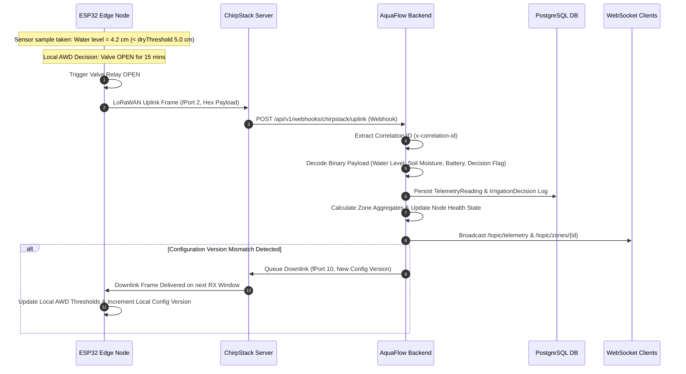

# AquaFlow Backend Services Architecture & Operations Guide

Production-ready Spring Boot backend for the AquaFlow Smart Alternate Wetting and Drying (AWD) Irrigation System.

---

## 1. Project Overview & Purpose

**AquaFlow** is an IoT-enabled smart agricultural irrigation platform designed specifically for rice cultivation using Alternate Wetting and Drying (AWD) water management. The system monitors field water levels, soil moisture, battery status, and sensor telemetry across edge-deployed microcontroller nodes (ESP32) and coordinates telemetry ingestion, zone aggregation, cloud-to-edge configuration synchronization, manual irrigation controls, and audit logging.

### Primary Goals:
- **Water Conservation**: Automate AWD threshold monitoring to reduce agricultural water consumption by up to 30% while maintaining crop yields.
- **Edge Resilience**: Guarantee continuous field operation even during total cloud disconnects by empowering ESP32 edge nodes with full autonomous decision-making capability.
- **Operational Visibility**: Provide real-time telemetry streaming, aggregated field water-level monitoring, node health degradation tracking, and non-repudiable audit logging.

---

## 2. Architecture & Data Flow

### Architecture Principles & Edge Autonomy

> [!IMPORTANT]
> **CRITICAL DOMAIN INVARIANT: ZERO CLOUD AUTONOMOUS DECISIONS**
> 
> In the AquaFlow platform architecture:
> 1. **Irrigation decisions are made locally and autonomously by ESP32 edge nodes.** Edge nodes evaluate local water sensors against configured AWD thresholds (`dryThresholdCm`, `refloodThresholdCm`) and execute valve operations directly.
> 2. **The Cloud Backend NEVER independently makes autonomous valve open/close decisions.** The cloud backend's role is strictly confined to:
>    - Observing and storing telemetry readings and node health metrics.
>    - Recording and auditing edge-reported autonomous decisions (`IrrigationDecision`).
>    - Synchronizing AWD configuration threshold versions to edge nodes (`ConfigSyncTask`).
>    - Dispatching operator-initiated manual override commands and high-priority Emergency Stop commands.

### High-Level System Architecture Diagram

```mermaid
flowchart TD
    subgraph Edge Layer
        ESP32[ESP32 Edge Node] -->|LoRaWAN Uplink| Gateway[ChirpStack Gateway / Network Server]
        Sensor[Water Level & Soil Sensors] --> ESP32
        Valve[Solenoid Valve Actuator] <-- ESP32
    end

    subgraph ChirpStack Integration
        Gateway -->|HTTP Webhook / MQTT| WebhookCtrl[ChirpStackWebhookController]
    end

    subgraph AquaFlow Spring Boot Backend
        WebhookCtrl --> TelemetryService[TelemetryServiceImpl]
        TelemetryService --> PayloadDecoder[PayloadDecoderImpl]
        TelemetryService --> TelemetryRepo[(PostgreSQL Telemetry Table)]
        TelemetryService --> ZoneAggregator[ZoneAggregationServiceImpl]
        TelemetryService --> HealthMonitor[NodeHealthServiceImpl]
        TelemetryService --> EventBroadcaster[WebSocketEventPublisher]
        
        ZoneAggregator --> ZoneRepo[(Zone / Field Aggregates)]
        HealthMonitor --> NodeRepo[(EdgeNode Health Status)]
        
        CmdCtrl[DownlinkCommandController] --> CmdService[DownlinkCommandServiceImpl]
        CmdService -->|Downlink Frame| Gateway
        
        ConfigSyncService[ConfigSyncServiceImpl] -->|Versioned Config Downlink| CmdService
    end

    subgraph Frontend / Operators
        EventBroadcaster -->|STOMP WebSockets| Dashboard[Web / Mobile Dashboard]
        Dashboard -->|REST API| CmdCtrl
    end
```

### Data Flow (ESP32 $\rightarrow$ LoRaWAN $\rightarrow$ Backend $\rightarrow$ Frontend)



---

## 3. Technology Stack

- **Java JDK**: 21 (LTS)
- **Framework**: Spring Boot 3.2.x
- **Database**: PostgreSQL 16+
- **Database Migration**: Flyway
- **ORM / Data Access**: Spring Data JPA / Hibernate 6
- **Security & Auth**: Spring Security + JWT (io.jsonwebtoken 0.12.x)
- **Realtime Streaming**: Spring WebSocket with STOMP & SockJS fallback
- **Observability**: Spring Boot Actuator, Micrometer, Prometheus metrics
- **API Documentation**: Springdoc OpenAPI / Swagger UI 2.x
- **Build Tool**: Apache Maven 3.9+
- **Containerization**: Docker, Docker Compose

---

## 4. Repository Structure

```
aquaflow_backend/
├── docker-compose.yml              # Multi-container orchestration (DB, App, ChirpStack, Prometheus)
├── Dockerfile                      # Multi-stage production container build
├── pom.xml                         # Maven dependencies & build lifecycle configuration
├── .env.example                    # Template environment variables (no real secrets)
├── README.md                       # Repository technical documentation
└── src/
    ├── main/
    │   ├── java/com/aquaflow/backend/
    │   │   ├── config/             # Spring Security, WebSocket, Async, OpenAPI configs
    │   │   ├── controller/         # REST & Webhook HTTP controllers
    │   │   ├── dto/                # Data Transfer Objects & Request/Response schemas
    │   │   ├── entity/             # JPA Entities (EdgeNode, TelemetryReading, Field, etc.)
    │   │   ├── exception/          # Global Exception Handling & Custom Exceptions
    │   │   ├── infrastructure/     # External integrations (ChirpStack, MQTT)
    │   │   ├── repository/         # Spring Data JPA Repositories
    │   │   ├── security/           # JWT Filters, Role definitions, Auth Providers
    │   │   ├── service/            # Core Business Logic & Domain Services
    │   │   │   └── impl/           # Business logic service implementations
    │   │   └── websocket/          # STOMP WebSocket handlers & topic publishers
    │   └── resources/
    │       ├── application.properties         # Main application configuration
    │       ├── application-dev.properties     # Development profile configuration
    │       ├── application-prod.properties    # Production profile configuration
    │       └── db/migration/                  # Flyway SQL migration scripts
    │           ├── V1__init_schema.sql
    │           ├── V2__seed_initial_data.sql
    │           └── V3__add_telemetry_indexes.sql
    └── test/
        └── java/com/aquaflow/backend/ # Unit & Integration Test Suites
```

---

## 5. Domain Model & Entities

- **`Field`**: Agricultural field boundary containing multiple monitoring zones.
- **`MonitoringZone`**: Specific sub-area within a field with designated target water level thresholds.
- **`EdgeNode`**: ESP32 microcontroller device deployed in a monitoring zone, identified by a unique `devEUI`.
- **`MonitoringPoint`**: Physical sensor installation point within a zone.
- **`TelemetryReading`**: Time-series telemetry sample (water level cm, soil moisture %, battery voltage, RSSI, SNR, fCnt).
- **`IrrigationDecision`**: Autonomous valve action executed locally by ESP32 (`VALVE_OPEN`, `VALVE_CLOSE`, `IDLE`).
- **`AutoIrrigationConfig`**: AWD threshold parameters (`dryThresholdCm`, `refloodThresholdCm`, `maxValveOpenDurationMins`, `configVersion`).
- **`DownlinkCommand`**: Queue item for manual override or configuration sync downlinks to edge nodes.
- **`IrrigationAuditLog`**: Immutable operational and security audit log.
- **`User`**: User entity with assigned authority roles (`ROLE_ADMIN`, `ROLE_OPERATOR`, `ROLE_VIEWER`).

---

## 6. Complete REST & WebSocket API Inventory

All REST endpoints are under `/api/v1/`.

### Authentication Endpoints (`/api/v1/auth`)
- `POST /api/v1/auth/login`: User authentication returning JWT token.
- `POST /api/v1/auth/refresh`: Refresh JWT access token.

### Edge Node Management (`/api/v1/nodes`)
- `GET /api/v1/nodes`: List edge nodes with optional status filtering.
- `GET /api/v1/nodes/{id}`: Fetch single node by ID.
- `POST /api/v1/nodes`: Register a new edge node (`ROLE_ADMIN`, `ROLE_OPERATOR`).
- `PUT /api/v1/nodes/{id}`: Update node parameters (`ROLE_ADMIN`, `ROLE_OPERATOR`).
- `GET /api/v1/nodes/{id}/health`: Retrieve current node health state (`HEALTHY`, `DEGRADED`, `CRITICAL`).

### Telemetry & Zone Aggregates (`/api/v1/telemetry`)
- `GET /api/v1/telemetry/nodes/{nodeId}`: Time-series telemetry readings for a node.
- `GET /api/v1/telemetry/zones/{zoneId}`: Zone water level and moisture aggregates.
- `GET /api/v1/telemetry/latest`: Latest snapshot for all active nodes.

### Downlink & Emergency Controls (`/api/v1/commands`)
- `POST /api/v1/commands/manual-override`: Dispatch manual valve OPEN/CLOSE command (`ROLE_ADMIN`, `ROLE_OPERATOR`).
- `POST /api/v1/commands/emergency-stop`: Issue Emergency Stop command across zone nodes (`ROLE_ADMIN`).
- `GET /api/v1/commands/status/{commandId}`: Poll command execution state.

### ChirpStack Integration Webhooks (`/api/v1/webhooks/chirpstack`)
- `POST /api/v1/webhooks/chirpstack/uplink`: Receive uplink telemetry webhooks from ChirpStack.
- `POST /api/v1/webhooks/chirpstack/ack`: Receive downlink delivery acknowledgements.

### Audit Logs (`/api/v1/audit`)
- `GET /api/v1/audit/logs`: Query immutable audit logs with time-range and entity filters.

### WebSocket Topics (`/ws-aquaflow`)
- `/topic/telemetry`: Real-time telemetry broadcast.
- `/topic/nodes/{id}/status`: Live node status updates.
- `/topic/zones/{id}/aggregates`: Live zone aggregates.
- `/topic/commands/ack`: Real-time command ACKs.

---

## 7. Edge Node Communication & LoRaWAN Transport

### LoRaWAN Uplink & Frame Handling
- **fPort 2**: Standard telemetry uplink (water level, soil moisture, battery, RSSI, SNR, fCnt, decision flag).
- **fPort 10**: Configuration sync request / version ACK uplink.
- **fPort 15**: Alarm / Emergency state notification uplink.

### Device Identity Resolution & Webhooks
1. ChirpStack posts JSON payload to `/api/v1/webhooks/chirpstack/uplink`.
2. Backend validates `X-ChirpStack-Signature` against `AQUAFLOW_CHIRPSTACK_WEBHOOK_SECRET`.
3. Backend matches `devEUI` to registered `EdgeNode` record in PostgreSQL.
4. Frame counter `fCnt` is checked for replay attack prevention.

---

## 8. Autonomous Edge Irrigation Architecture

```
+-------------------------------------------------------------+
|                     ESP32 EDGE NODE                         |
|                                                             |
|  [ Water Sensor ] ---> [ Threshold Evaluation Logic ]       |
|                               |                             |
|                               v                             |
|                      [ Solenoid Valve ]                     |
|                                                             |
|  Local Decisions:                                           |
|  Water < dryThreshold (5.0cm)  ==> OPEN Valve               |
|  Water > reflood (15.0cm)      ==> CLOSE Valve              |
+-------------------------------------------------------------+
                              |
                     LoRaWAN RF Uplink
                              |
                              v
+-------------------------------------------------------------+
|                  AQUAFLOW CLOUD BACKEND                     |
|                                                             |
|  1. Persist Telemetry & Decision Audit Log                  |
|  2. Aggregate Zone Moisture / Water Levels                  |
|  3. Monitor Node Freshness / Degradation                    |
|  4. Push Config Updates (downlink) if Version Mismatched    |
|  5. Stream Live Metrics to WebSocket Dashboard              |
+-------------------------------------------------------------+
```

---

## 9. Security & Secret Management

1. **JWT Bearer Auth**: Stateless HTTP Authorization via `Authorization: Bearer <token>`.
2. **Role-Based Access Control**:
   - `ROLE_ADMIN`: Node registration, emergency stop, configuration changes, user management.
   - `ROLE_OPERATOR`: Field operation, manual override, telemetry query.
   - `ROLE_VIEWER`: Read-only access to metrics and logs.
3. **Docker Secret Integration**: Production secrets mounted to `/run/secrets/` (`db_password`, `jwt_secret`, `webhook_secret`).
4. **No Hardcoded Credentials**: Zero secrets stored in source code. All secrets loaded from environment or secrets volume.

---

## 10. Database Architecture & Migrations

- **Database Engine**: PostgreSQL 16+
- **Migration Framework**: Flyway (`src/main/resources/db/migration/`)
- **Key Migrations**:
  - `V1__init_schema.sql`: Core table creation.
  - `V2__seed_initial_data.sql`: Base roles and default system user seeding.
  - `V3__add_telemetry_indexes.sql`: Time-series composite indexes on `(node_id, timestamp)`.

---

## 11. Configuration & Environment Variables

| Variable | Default Value | Description |
| :--- | :--- | :--- |
| `SPRING_PROFILES_ACTIVE` | `dev` | Profile (`dev`, `staging`, `prod`, `test`). |
| `SERVER_PORT` | `8080` | Application HTTP port. |
| `SPRING_DATASOURCE_URL` | `jdbc:postgresql://localhost:5432/aquaflow_db` | JDBC database URL. |
| `SPRING_DATASOURCE_USERNAME` | `aquaflow_user` | Database user. |
| `SPRING_DATASOURCE_PASSWORD` | `aquaflow_password` | Database password. |
| `AQUAFLOW_JWT_SECRET` | `changeit_min_32_chars_base64_secret_key_required!` | Secret key for signing JWTs. |
| `AQUAFLOW_JWT_EXPIRATION_MS` | `86400000` | JWT token validity in milliseconds (24h). |
| `AQUAFLOW_CHIRPSTACK_WEBHOOK_SECRET` | `webhook_secret_key_placeholder` | Webhook signature verification secret. |

---

## 12. Local Development Setup

### Prerequisites
- JDK 21
- Apache Maven 3.9+
- Docker & Docker Compose

### Commands
```bash
# Clone and prepare env
cp .env.example .env

# Start database container
docker compose up -d db

# Run Spring Boot application locally
mvn spring-boot:run

# Execute tests
mvn clean test
```

---

## 13. API Usage Examples

### 1. Authenticate & Obtain JWT Token
```bash
curl -X POST http://localhost:8080/api/v1/auth/login \
  -H "Content-Type: application/json" \
  -d '{"username": "operator1", "password": "secure_password_placeholder"}'
```

### 2. Fetch Latest Telemetry Snapshot
```bash
curl -X GET http://localhost:8080/api/v1/telemetry/latest \
  -H "Authorization: Bearer <YOUR_JWT_TOKEN>"
```

### 3. Issue Manual Valve Override
```bash
curl -X POST http://localhost:8080/api/v1/commands/manual-override \
  -H "Authorization: Bearer <YOUR_JWT_TOKEN>" \
  -H "Content-Type: application/json" \
  -d '{"nodeId": "123e4567-e89b-12d3-a456-426614174000", "action": "OPEN", "durationMins": 15}'
```

---

## 14. Testing Strategy

- **Unit Tests**: Mockito & JUnit 5 testing business logic services.
- **Integration Tests**: `@SpringBootTest` testing controllers, security filters, and repository queries.
- **Database Tests**: Testcontainers PostgreSQL integration.
- **Security Tests**: Verification of JWT token validation, role enforcement, and invalid token rejection.

Execute test suite:
```bash
mvn clean test
```

---

## 15. Observability & Monitoring

- **Health Probes**: `GET /actuator/health`, `/actuator/health/liveness`, `/actuator/health/readiness`
- **Prometheus Metrics**: `GET /actuator/prometheus`
- **Structured Logging**: SLF4J / Logback with JSON formatting and `x-correlation-id` tracing.

---

## 16. Deployment Architecture

- Multi-container setup defined in `docker-compose.yml`:
  - `app`: Spring Boot Application service.
  - `db`: PostgreSQL 16 database with persistent volume.
  - `prometheus`: Metrics collection scraper.
- Built using Docker multi-stage `Dockerfile` producing a minimal JRE 21 runtime container.

---

## 17. Development Conventions

- **Separation of Concerns**: DTOs strictly separated from JPA Entities using MapStruct / mapper methods.
- **Error Handling**: `@ControllerAdvice` returning standardized RFC-7807 problem details JSON format.
- **Code Style**: Standard Java Google Style format.

---

## 18. Current Implementation Status

| Capability / Module | Status | Details |
| :--- | :--- | :--- |
| **Telemetry Ingestion & Decoding** | **IMPLEMENTED** | Webhook handler, binary payload decoder, DB persistence. |
| **Zone Aggregation & Health** | **IMPLEMENTED** | Aggregation service, stale telemetry degradation tracking. |
| **Manual Override & Emergency Downlinks**| **IMPLEMENTED** | Downlink command queueing & ChirpStack integration. |
| **STOMP WebSockets** | **IMPLEMENTED** | Live topic broadcasts for telemetry, status, and zone metrics. |
| **Multi-Tenant Isolation** | **PLANNED** | Tenant ID filtering planned for v2.0. |

---

## 19. Known Limitations & TODOs

- **Transport Protocols**: Currently supports LoRaWAN/ChirpStack; Cellular/NB-IoT transport adapters are under development.
- **Offline Downlink Sync**: Direct peer-to-peer ESP-NOW mesh downlinks are under evaluation for gateway out-of-reach nodes.

---

## 20. Quick Reference

- **Run Dev Server**: `mvn spring-boot:run`
- **Run Full Tests**: `mvn clean test`
- **Docker Up**: `docker compose up -d`
- **Health Check**: `curl http://localhost:8080/actuator/health`
- **Swagger UI**: `http://localhost:8080/swagger-ui.html`
